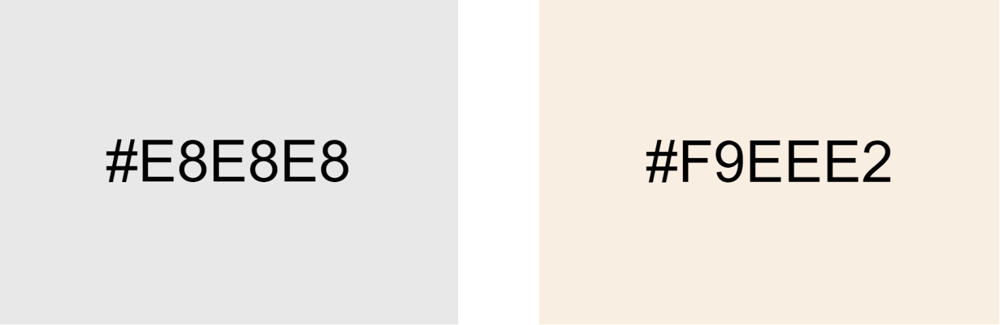
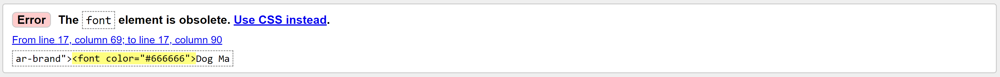
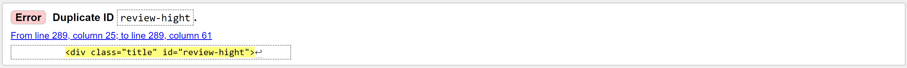
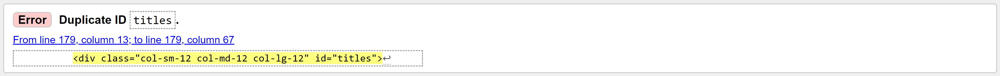
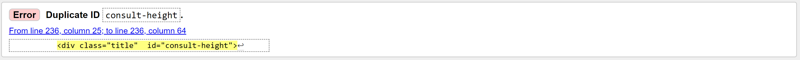
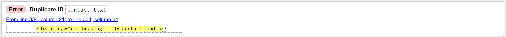
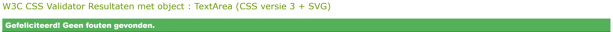

# Dog Massage Pluto
This website is designed for dog-owners who want to improve their dog’s health and for who wants to know more about dog massage.   
Read about the sorts of dog massages available, it’s benefits, my story, client stories, more information about the consult, the contact details and a contact form.

This website consists of the following sections:
<ol>
    <li><strong>Home</strong> – this section provides the reader information about the sorts of dog massages that are given.
    <li><strong>All Benefits</strong> – this section provides all the massage benefits.
    <li><strong>About Me</strong> – this section tells a little bit of my story.
    <li><strong>Consult</strong> – this section provides all the information about a consult.
    <li><strong>Reviews</strong> – this section shows some reviews of previous clients.
    <li><strong>Contact</strong> – this section provides al the contact details and a contact form.
</ol>

## Demo 
Website demo available <a href="https://kimkesdev.github.io/DogMassagePluto">here</a>.
 

# UX Design
I wanted to create a simple and friendly website with light colours and with all the information on one page, so that it becomes a scrollable website.

## User Stories
<strong>User Story 1:</strong> Owner of an old dog with stiff muscles in his legs, who would like to know what he can do for his dog to make the less stiff.
  
<strong>User Story 2:</strong> Owner of a stressed dog when seeing other dogs, who wants to know how to ease the tension of his dog.
  
<strong>User Story 3:</strong> A sportive person with a sportive dog, want to know how he can help his dog with a faster recovery of the muscles.
  
<strong>User Story 4:</strong> Owner of a dog with pain after a accident, what can be done to relieve the pain.
  
<strong>User Story 5:</strong> Owner of a dog who is afraid of people, how massage can help the dog to be less anxious.
  
<strong>User Story 6:</strong> Owner of a dog with  arthritis, how massage can release tension.
  
<strong>User Story 7:</strong> Owner of a senior dog, who wants to reduce the need of medicine.
 

## Strategy
The goal for this website is to show how a dog’s health can be improved through massage.

## Scope
Massage types, all benefits, about me, consult, contact and social media links.

## Structure
<ul>
    <li><strong>Header</strong> with the title and a menu.
    <li><strong>Types of massage</strong> with its benefits and a list with all benefits.
    <li><strong>About me</strong> section with a little bit about my working life.
    <li><strong>Consult</strong> section with information about a consult.
    <li><strong>Reviews</strong> section with some reviews of happy dog-owners who’s dog had a massage session.
    <li><strong>Contact</strong> section with all the contact details and a contact form.
    <li><strong>Footer</strong> with the social media links.
</ul>

## Skeleton
<ul>
    <li><strong>Header</strong> 
    Light grey background. Left the title, right the menu.
    <li><strong>Massage types</strong> 
    Soft yellow background, each section with an image next to the text, text starting left on the first section, each type op massage has the opposite text-image combination.
    <li><strong>All benefits</strong> 
    Title: light grey background, float in the centre.  
    Text: soft yellow background, three rows with benefits.
    <li><strong>About me</strong> 
    Title: light grey background, float in the centre.  
    Text: soft yellow background, text left, image right.
    <li><strong>Consult</strong> 
    Title light grey background, flout in the centre.  
    Text: soft yellow background, text right, image left, opposite of the above.
    <li><strong>Reviews</strong> 
    Title: light grey background, float in the centre. 
    Text: soft yellow background, three rows with reviews.
    <li><strong>Contact</strong> 
    Title: light grey background, float in the centre. 
    Text: soft yellow background, three rows with information.  
    Right section: contact information, centre section: contact form, right section: image.
</ul>
<ul>
    <li>All title font: same font family
    <li>All text font: same font family
    <li>Font and text colour: dark grey
</ul>

## Surface
<ul>
    <li>Titles font family: Righteous.
    <li>Text font family: Helvetica.
    <li>Header, titles and footer section color = #E8E8E8 (light grey).
    <li>Section color = Ef9EEE2 (light yellow).
    <li>Text color = E666666 (dark grey).
</ul>

## Mockups & Wireframes
The following wireframes were created using Balsamiq to design the website layout options:
<ul>
    <li><a href="https://github.com/kimkesdev/DogMassagePluto/blob/master/mockups/Wireframes%20Mobile%20Dog%20Massage%20Pluto.pdf">Mobile display</a>
    <li><a href="https://github.com/kimkesdev/DogMassagePluto/blob/master/mockups/Wireframes%20Ipad%20Dog%20Massage%20Pluto.pdf">IPad display</a>
    <li><a href="https://github.com/kimkesdev/DogMassagePluto/blob/master/mockups/Wireframes%20Laptop%20Dog%20Massage%20Pluto.pdf">Laptop display</a>
</ul>

## Features
The webpage consists of the following features:
<ul>
    <li><strong>Navbar</strong> - The navbar stays collapsed on small and medium devices and Bootstrap bar icon is used.  The navbar contains links to associated pages: About Me, Consult and Contact
    <li><strong>Button</strong> - The contactform uses a Bootstrap button
    <li><strong>Social</strong> media icons - This project uses Bootstrap icons for social media
    <li><strong>Contact form</strong> - The project uses Bootstrap form features.  The form requires to provide first and last name, email address, phone number and message
    <li><strong>Footer</strong> - simple footer containing links to social media accounts and copyrights
</ul>

# Technologies 

## Languages
<ul>
    <li>HTML
    <li>CSS
</ul>

## Frameworks / Tools / Libraries
<ul>
    <li><a href="https://balsamiq.com/">Balsamiq</a> for the mockups.
    <li><a href="https://getbootstrap.com/">Bootstrap</a> for the collapsible navbar en the footer icons.
    <li><a href="https://fonts.google.com/">Google Fonts</a> for the font type Righteous.
</ul>

## Testing
<ul>
    <li><a href="https://validator.w3.org/">HTML Validator</a> for testing the HTML code.
    
    
    
    
    
    <li><a href="https://jigsaw.w3.org/css-validator/">CSS Validator</a> for testing the CSS code.
    

    <li>Google Chrome Developer Tools for testing different device sizes.
</ul>

# Testing
<ul>
    <li><strong>Header</strong>  
    The header is responsive to small, medium and large devices.
    <li><strong>Small and medium devices</strong>  
    On small and medium devices the title and a collapsible menu will be shown. 
    On small devices some pictures are gone for a more user friendly website. 
    Each row will be shown vertical, for better readability.
    <li><strong>Large devices</strong>  
    On large devices the title and full menu will be shown. 
    Each row will be shown horizontal.
    <li><strong>Menu links</strong> 
    The menu links are internal links and will lead to the right part on the website.
    <li><strong>Contact form</strong> 
    The contact form has required attributes which are needed before submitting the form.
    <li><strong>Footer</strong> 
    In the footer the social media linkswill be found, which are external links.
    <li><strong>Title</strong>   
    The company name on the fixed header, will lead to the top of the website as an internal link. 
    <li><strong>Tested</strong> 
    Tested in multiple browser’s (Edge, Chrome, Safari, Internet Explorer, Firefox).  
    And tested in multiple small and medium devices (Galaxy S5, Pixel 2, Pixel 2 XL, iPhone 5/SE, iPhone 6/7/8, iPhone 6/7/8 Plus, iPhone X, iPad, iPad Pro.)
</ul>

# Deployment
I started working on this project in Repl.it because I worked on it from different devices.  
Every time I was on my own laptop I copied everything to GitPod and pushed it to GitHub.  
Like this I also always had an extra backup, when needed.  
 
This website starts with the: index.html, followed by the map ‘assets’, with a map of ‘images’ and a map of ‘css’.  
In the ’css’ map you will find the page: style.css. 
A map called 'mockups' with small, medium and large wireframes. 
a map called 'screenshots' with an image of the used colors and a demo.gif. 
Ending with the README.md.

# Credits

## Content
The full content is made up and written by me.

## Media
The photos used in this website were obtained from <a href="https://www.istockphoto.com/nl">istockphoto</a>.

## Acknowledgements
I used a lot of general knowledge from <a href="https://www.w3schools.com">w3schools</a>.
